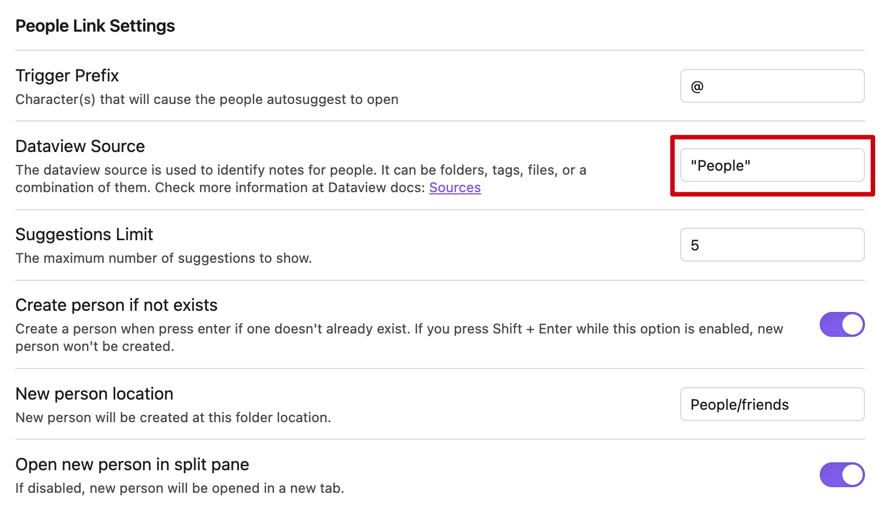
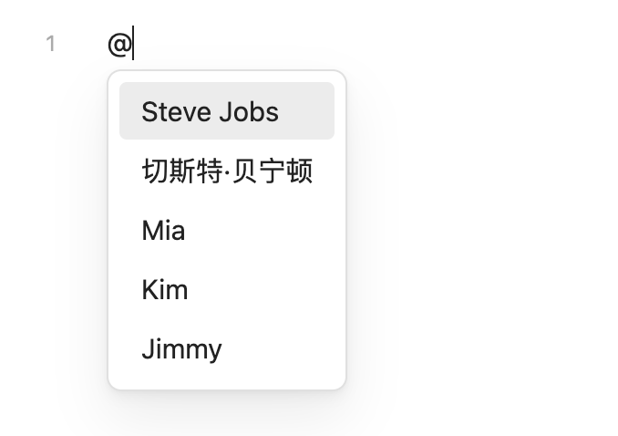
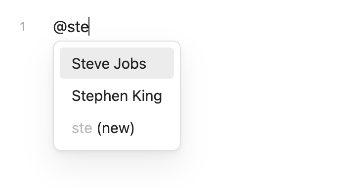
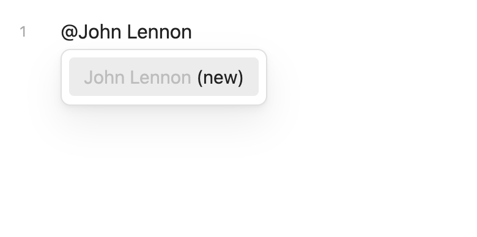

# Obsidian People Link

Easily create links to people within your notes.

Features:

- Type `@` to show a list of people's suggestions sourcing from a specific folder or tag, and press enter to create a link to the selected note for the person.
- Select `<person name> (new)` to create a new note for the person in a splited pane.

## Installation

**Prerequisite**:
To ensure proper functionality, you must install [Obsidian Dataview](https://github.com/blacksmithgu/obsidian-dataview) alongside this plugin.

This plugin is currently under review by the moderators before added to
the official plugins directory. if you want to try it now,
please use the [BRAT Plugin](https://obsidian.md/plugins?id=obsidian42-brat)
to install it.

## How to use

### Setup

After installing the plugin, you should first enable it and open the settings modal:

The most important setting is "Dataview Source", it's used to identify notes for people,
the default value is `"People"` (no trailing slash), which means to search people from the "People" folder
and all its sub folders.
You should change it according to your vault's structure.

You can also use tags to define "Dataview Source", for example `#contact`,
this will search all the notes with the tag `#contact`.

If you have multiple folders or tags for people, you can use the `or` operator,
the following example will search all the notes with the tag `#contact` or the folder "People":
`#contact or "People"`.

For more information, please refer to the Dataview documentation of [Sources](https://blacksmithgu.github.io/obsidian-dataview/reference/sources/).

### Basic usage

Simply type `@` in a note, you'll see a list of suggestions of the people in your vault.

People in the suggestions list are sorted by their last modified date from newest to oldest.
The number of results is limited to 5, you can change this in the settings.

When you start typing more letters, a fuzzy search will be performed,
updating the most relevant suggestions as you type.

You can use the arrow keys or <kbd>⌃ n</kbd>, <kbd>⌃ p</kbd> to navigate through the suggestions.
When you press Enter, the link to the selected note will be created.

### Create new note for a person

If the person does not exist yet, the color of the suggestion is dimmed and has a `(new)` suffix,
indicating that it will be created when you press Enter. This behavior could be disabled in the settings.

The new note is create at the specified location in the settings.
Upon creation, it opens in a split pane,
but can be adjusted to open in a new tab through the settings.

Unless it's an exact match, the new person suggestion is always appeared at the bottom,
making it possible to create a new person even if people with similar names are suggested.

### Cancel suggestion

You can press <kbd>⎋</kbd> (ESC) or <kbd>⇧ ⏎</kbd> (Shift + Enter) to cancel the suggestion,
leaving the content you typed unchanged.

## Settings reference

- **Trigger Prefix**

	Character(s) that will cause the people autosuggest to open

- **Dataview Source**

	The dataview source is used to identify notes for people. It can be folders, tags, files, or a combination of them. Check more information at Dataview docs: [Sources](https://blacksmithgu.github.io/obsidian-dataview/reference/sources/)

- **Suggestions Limit**

	The maximum number of suggestions to show.

- **Create person if not exists**

	Create a person when press enter if one doesn't already exist.

- **New person location**

	New person will be created at this folder location.

- **Open new person in split pane**

	If disabled, new person will be opened in a new tab.

## Credits

This project is made possible by the community surrounding it and especially the projects listed below:

- [liamcain/obsidian-daily-notes-interface](https://github.com/liamcain/obsidian-daily-notes-interface)
- [argenos/nldates-obsidian](https://github.com/argenos/nldates-obsidian)
- [blacksmithgu/obsidian-dataview](https://github.com/blacksmithgu/obsidian-dataview)
- [krisk/Fuse](https://github.com/krisk/Fuse)
